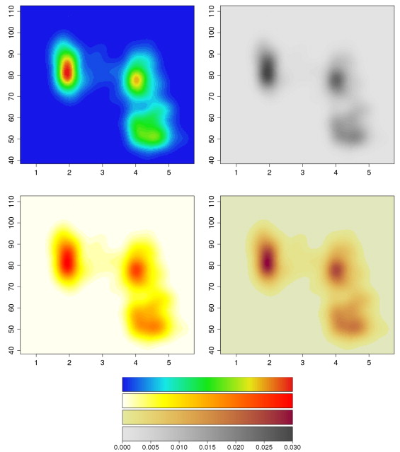
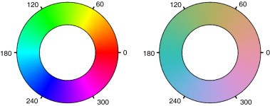
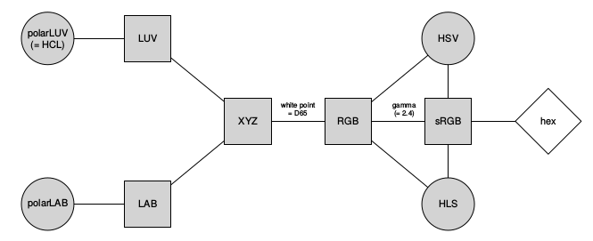
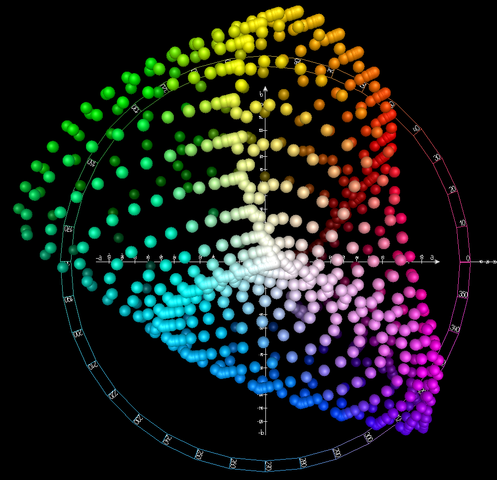
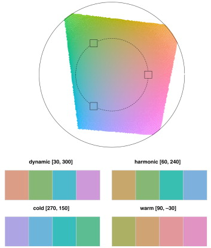
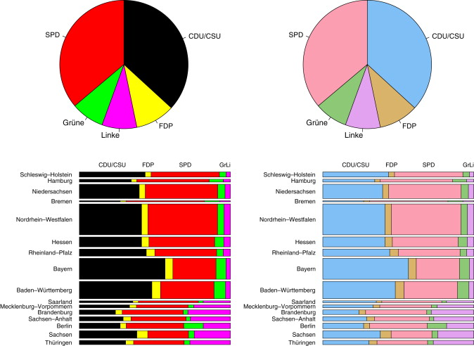
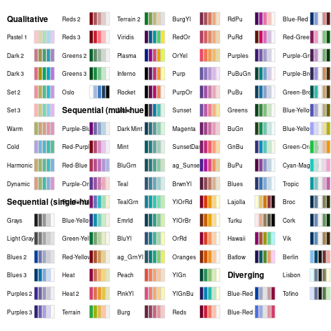
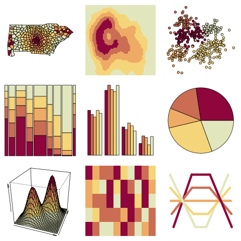
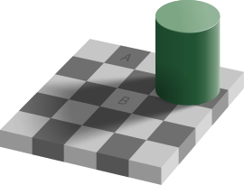
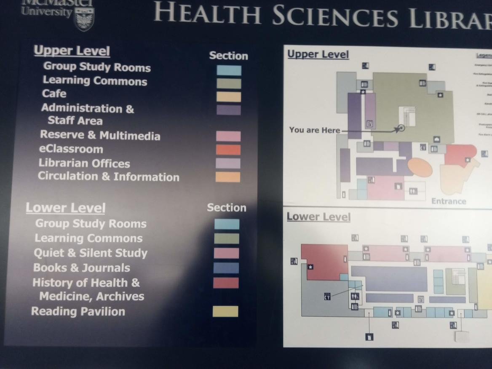

## packages

```{r pkgs,message=FALSE}
library(ggplot2)
library(dichromat)
## palettes etc.
library(viridis)
library(cividis) ## https://github.com/marcosci/cividis
library(colorspace)
library(RColorBrewer)
library(cowplot)
library(colorBlindness)
```

## use of colour

- qualitative (factors): want *distinctive* colours
    - probably can't get more than about 8 really distinctive colours
	 - less if you need to be color-blind friendly
	 - sometimes it helps to combine with shape  
(redundant coding)
- quantitative (continuous values)
    - sequential or diverging
    - consider using background color for zero point
	- or else clearly partition color values from background
	
## colour specification in R

- via names:

```{r names}
head(colours())
```

- via hex specification: `#RRGGBB` (**additive**, hexadecimal, colour specification: e.g. `#FFFFFF` = white, `#FF0000` = red (sometimes a fourth hex value indicates alpha-transparency)
- `adjustcolor` function can help you fiddle a color that you already like
- `apropos("colo|rgb"), ignore.case = FALSE)` brings up a whole bunch of relevant stuff (the pipe means "or" here)

## fade via transparency gradient

```{r fade1}
dd <- data.frame(x=1:9)
ggplot(dd,aes(x=x,y=1,alpha=x)) +
    geom_point(size=10,colour="red") +
    coord_fixed(ratio=5)+theme_void()
```


## fade via colour gradient

```{r fade2}
ggplot(dd,aes(x=x,y=1))+
  geom_point(size=10,aes(colour=x))+
  scale_colour_gradient(low="lightgray",high="red")+
  coord_fixed(ratio=5)+theme_void()
```

## saturation

* want large blocks of colour to be *unsaturated*
* small areas usually need to be *saturated*

## `display.brewer.all()`

```{r brewer_all,fig.height=6,echo=FALSE}
display.brewer.all()
```

## colour spaces

- want *perceptually uniform* spaces [@zeileis_escaping_2009]
- RGB: additive, pixel-based
- HSV (hue, saturation, value): *unbalanced*
- HCL (hue, chroma, luminance): *balanced* [@zeileis_colorspace_2019]

## @zeileis_escaping_2009 Fig 1

Old Faithful data (duration vs waiting time)

{height=400px}

HSV, grayscale, HSV heat, HCL heat

## @zeileis_escaping_2009 Fig 3

{width=100%}

(left) hue varies, constant saturation & value; (right) hue varies, constant chroma & luminance

## @zeileis_colorspace_2019 Fig 7

{width=100%}

## CIELAB space

{height=80%}

<div style="font-size:8px">
By Holger kkk Everding - Own work, CC BY-SA 4.0, https://commons.wikimedia.org/w/index.php?curid=38366968
</div>

## @zeileis_escaping_2009 Fig 4



## @zeileis_escaping_2009 Fig 7



## colorspace palettes

```{r colorspace, results="hide"}
png("pix/colorspace.png")
hcl_palettes(plot=TRUE)
dev.off()
```

## colorspace palettes



## colorspace demos

```{r color_demo, results="hide"}
png("pix/colordemo.png")
par(mfrow = c(3, 3), mar = c(1,1,1,1))
cl <- sequential_hcl(5, "Heat")
for (i in c("map", "heatmap", "scatter", "spine",
            "bar", "pie", "perspective", "mosaic", "lines")) {
  demoplot(cl, type = i)
}
dev.off()
```

## colorspace demos

{width=60%}

## I Want Hue


Why stick to a single path in the colour space? Why not fill an area?

[demo](https://medialab.github.io/iwanthue/)

`hues`, `randomcoloR` (`randomColor()` !)

## colourblind-friendliness

* most common: [deuteranomaly](https://en.wikipedia.org/wiki/Color_blindness#Protanopia), $\approx$ 5% of males
* red-green axis is collapsed in various ways
* trivia: "Daltonism" (after [John Dalton](https://en.wikipedia.org/wiki/John_Dalton))

## viridis vs. cividis

```{r viridis, echo=FALSE}
gg0 <- ggplot(dd,aes(x=x,y=1,colour=x)) +
  geom_point(size=10)+
  coord_fixed(ratio=5)+
  theme_void()+
  theme(legend.position="none")
plot_grid(gg0 +scale_colour_viridis() +ggtitle("viridis"),
            gg0 + scale_colour_cividis() + ggtitle("cividis"),
          align="h",
          ncol=1)
```

## illustrate dichromat package

<!-- https://stackoverflow.com/questions/28011258/graphics-on-next-slide-with-ioslides-using-rstudios-rmd -->
<!-- hack -->

```{r dichrom, eval=FALSE}
par(mfrow=c(2,2),mar=c(1,1,1,1))
p <- brewer.pal("Set1",n=6)
pie(rep(1,6), col=p,main="ColourBrewer Set1")
pie(rep(1,6), col = dichromat(p))
p2 <- brewer.pal("Dark2",n=6)
pie(rep(1,6), col=p2, main="ColourBrewer Dark2")
pie(rep(1,6), col = dichromat(p2))
```

---

```{r dichrom2, echo=FALSE}
par(mfrow=c(2,2),mar=c(1,1,1,1))
p <- brewer.pal("Set1",n=6)
pie(rep(1,6), col=p,main="ColourBrewer Set1")
pie(rep(1,6), col = dichromat(p))
p2 <- brewer.pal("Dark2",n=6)
pie(rep(1,6), col=p2, main="ColourBrewer Dark2")
pie(rep(1,6), col = dichromat(p2))
```

## more packages

- `colorblindr` (`clauswilke/colorblindr`), `colorBlindness` (CRAN)

```{r cb, warning=FALSE, out.width = "75%"}
colorBlindness::displayAvailablePalette(color="white")
```

## online

upload an image or point to a URL

* https://www.toptal.com/designers/colorfilter/
* http://www.color-blindness.com/coblis-color-blindness-simulator/

## contrast illusions

Colour appearance depends on neighbours



([Wikipedia](https://en.wikipedia.org/wiki/Optical_illusion))

* think about backgrounds!
* another reason to distrust heatmaps

##

{width=75%}

## cultural expectations

* red-yellow-green is still used a lot ...
* political parties
* "topographic" colours

---

```{r topo}
(ggplot(dd,aes(x=x,y=1,colour=factor(x)))
  + geom_point(size=10)
  +  coord_fixed(ratio=5)
  + theme(legend.position="none")
  +   scale_colour_manual(values=topo.colors(9))
  + theme_void()
  + theme(legend.position="none")
)
```

## more on available stuff ...

```{r colourpkgs, message=FALSE}
library(ggplot2); library(colorspace); library(viridis)
length(apropos("scale_colour_"))
```

## references
