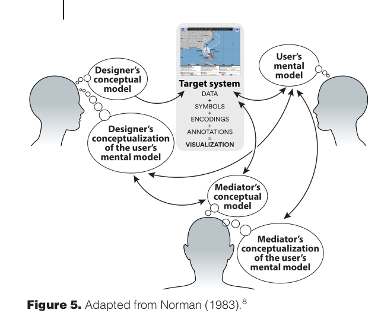

<style>
.refs {
   font-size: 14px;
}
</style>

## data collection 

@schermann_ethics_2019; @skau_code_2012

- data sources reliable and verifiable
- due diligence in checking sources
- give attribution
- beware of sampling bias [@cairo_ethical_2014]

## data analysis

- transparent/reproducible analysis
   - ethical or professional?
- beware snooping/hacking

## design

- telling a story vs *the* story
- journalistic, again
- @cairo_ethical_2014

## is poor design immoral?

> When a designer chooses a graphic form to represent data just because she likes it, while ignoring evidence that may lead her to choose a more appropriate one, her act is morally wrong. It's not wrong just because she's not been virtuous or because there is a deontological rule against inappropriate charts, but because her act will likely have negative consequences, such as confusion, obfuscation and misunderstanding." [see ["rule utilitarianism"](https://en.wikipedia.org/wiki/Rule_utilitarianism)]

## are you responsible for viewers' interpretations?

```{r echo=FALSE, out.width="60%"}

```

@cairo_if_2020 on "sharpiegate"

## accessibility

- [twitter thread](https://twitter.com/FrankElavsky/status/1396898372183855105)

```{r echo=FALSE, out.width = "60%"}

```

---

alt-text:

> "A set of stairs where each step is a glowing, translucent, glass-like structure jutting out at different angles. Each step has no back wall and gaps in the flooring before the next step. A railing is nested into a wall on one side and the other side is completely open with no railing or wall at all. A stove top is within a short fall from the open side of the stairs."

## thread on accessibility (summary)

- contrast, colour (4.5:1 contrast for text, 3:1 contrast for geometries)
- interactivity can be tricky
- use standard designs!

## alt-text

- always provide "alt-text" for online images
- challenging/time-consuming
- @lundgard_accessible_2022: analyzing semantic content of alt-text
   - automation possible, but possibly worse than nothing

## tradeoffs

- think about tradeoffs
- maximize broad utility


## references {.refs}
