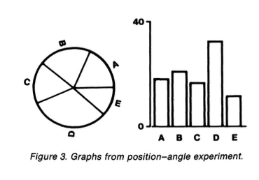

<!-- conclusion about pix width: ioslides can *only* handle widths in 
   units of pixels, not in [inches] 
 despite https://stackoverflow.com/questions/45306242/resizing-external-image-in-rmarkdown-html-vs-ioslides-output which suggests that

 a chunk with  out.width  and echo=FALSE plus
knitr::include_graphics("pix/John_Tukey.jpg")
does the trick -->

<!-- 
apa.csl is a slightly hacked version of APA 
  (modified for "et al" after 2 authors in text)
-->
<!-- .refs is style for reference page (small text) -->
<style>
.refs {
   font-size: 16px;
}
h2 { 
 color: #3399ff;		
}
h3 { 
 color: #3399ff;		
}
.title-slide {
   background-color: #55bbff;
}
</style>
<!--    content: url(https://i.creativecommons.org/l/by-sa/4.0/88x31.png)

<!-- Limit image width and height -->
<style type="text/css">
img {     
  max-height: 530px;     
  max-width: 800px; 
}
</style>

## we recommend ... 

<div class = "columns-2">


@rauser_how_2016


@wilke_fundamentals_2019

</div>

## Esquisse

(demonstrate)

## Packages

```{r pkgs, message=FALSE}
library(ggplot2); theme_set(theme_bw())
zmargin <- theme(panel.spacing=grid::unit(0,"lines"))
library(ggthemes)  ## tufteboxplot, scale_*_colourblind
library(directlabels)
library(ggpubr)
library(palmerpenguins)  ## data
library(ggbeeswarm)
library(cowplot) ## for arranging multiple plots, labeling, etc.
library(colorblindr) ## remotes::install_github("clauswilke/colorblindr")
```

# Cleveland:<br>quantifying viz efficacy

{width="150px"}

## principles

- accuracy of quantitative representation
- visual estimation of *differences*

## perceptual experiments

- show participants the same data in different formats
- ask them questions about relative magnitudes



## perceptual experiments: results


## is Cleveland still relevant?

- yes!
- @elliott_39_2016, "39 studies about human perception in 30 minutes"
    - healthy tradition of scientific experiments on graphical perception
	     - accuracy
		 - memory
		 - preference

---


@heer_crowdsourcing_2010

# Edward Tufte

{width="200px"}

## Tufte principles

- functional, minimal graphics
- maximize data-ink / minimize non-data-ink
- don't lie (**lie factor**)
- small multiples (= trellis/lattice, facets, panels)
- "As for a picture, if it ain't worth 1000 words, the hell with it" - [Ad Reinhardt](https://aphelis.net/how-look-reinhardt/)
- information at the point of need (legends etc.)

"Understand that Tufte’s ideas are a good starting point, not a religion"
([Robert Kosara](https://eagereyes.org/criticism/edward-tufte-one-day-course))

## data ink

```{r tufteboxplot,fig.height=4}
g0 <- (ggplot(OrchardSprays,
              aes(x = treatment, y = decrease))
  + scale_y_log10()
)
pg0 <- plot_grid(g0 +
             geom_boxplot(fill = "gray") +
             ggtitle("standard boxplot"),
          g0 +
             geom_tufteboxplot(stat="boxplot") +
             ggtitle("Tufte 'boxplot'")
          )
```

##

```{r echo=FALSE}
print(pg0)
```

## information at the point of need

- less eye movement is better
- direct labels > legends > info in caption > info in text

```{r directlabels0, warning = FALSE}
g1 <- (ggplot(penguins,
              aes(x = bill_length_mm, y = bill_depth_mm,
                  colour = species, shape = species))
  + geom_point()
  + scale_colour_colorblind()
)
pg1 <- plot_grid(g1 + ggtitle("usual legend"),
                 direct.label(g1) +
                 ggtitle("direct labeling"))
```

##

```{r directlabels1,fig.width=10,fig.height=4, echo = FALSE, warning = FALSE}
print(pg1)
```

## direct labeling

- manually **if necessary**
- `directlabels` package
     - variety of labeling choices, e.g. `last.bumpup`: "Label last points, bumping labels up if they collide"
     - [documentation](https://tdhock.github.io/directlabels/)
	 - `geom_dl()` for finer control
- also `ggrepel` (auto-repelling text labels)	 

## localize the most important contrasts

```{r contrasts, echo = FALSE, warning = FALSE, message=FALSE}
g3 <- (ggplot(penguins) +
       geom_boxplot(aes(y = bill_length_mm)) +
       scale_fill_colorblind()
)
pg3 <- (plot_grid(
    g3 +  aes(x = species, fill = sex) + ggtitle("sexes within species") +
    ggthemes::scale_fill_colorblind(),
    g3 +  aes(x = sex, fill = species) + scale_fill_OkabeIto() +
    ggtitle("species within sex"))
)
print(pg3)
``` 
 
## and by island (with great power ...)

```{r by_island, echo=FALSE, warning=FALSE, message=FALSE}
print(g3 +  aes(x = species, fill = sex) 
      + ggthemes::scale_fill_colorblind()
      + facet_grid(.~island, scale = "free_x", space = "free",
                   label = label_both) 
      + zmargin
  )
```

## Data presentation scales with data size

<!-- vertical/top alignment would be nice but is hard -->

```{r tab, echo=FALSE, results = "asis"}
tt <- read.table(sep = "|", header = TRUE, text = "
data size     | approach | method
small (1-20)  | show all points (possibly dodged/jittered) | **categorical**: points, dotplot, beeswarm; **continuous**; points + line
medum (10-50) | robust summaries; show appropriate detail, downweight outliers | **categorical**: boxplot; **continuous**: loess, GAM, histogram
large (50+/group) | complex summaries; reveal patterns, ease computation | **categorical**: violins etc; **continuous**: density plots, hexbin
")
pander::pandoc.table(tt, justify = "left", split.cells = c(20, 20, 30))
```

<!-- beanplot; rugs+scatterplot; [pirate plots](https://bookdown.org/ndphillips/YaRrr/pirateplot.html) -->

## descriptive (points)

```{r examples_desc1, echo = FALSE, fig.width = 10, fig.height = 4, warning = FALSE}
g4 <- ggplot(penguins, aes(x=species, y = bill_depth_mm))
g4A <- (g4 + geom_point() + ggtitle("plain points"))
g4B <- (g4 + geom_jitter(height = 0, width =0.1) + ggtitle("horizontal jitter"))
g4C <- (g4 + geom_beeswarm() + ggtitle("beeswarm"))
plot_grid(g4A, g4B, g4C, nrow = 1)
```

## descriptive (boxes/violins)

```{r examples_desc2, echo = FALSE, fig.width = 10, fig.height = 4, warning = FALSE}
g4D <- (g4 + geom_boxplot(fill = "gray") + ggtitle("boxplot"))
g4E <- (g4 + geom_boxplot(fill = "gray", notch = TRUE) + ggtitle("boxplot w/ notch"))
g4F <- (g4 + geom_violin(fill = "gray") + ggtitle("violin"))
plot_grid(g4D, g4E, g4F, nrow = 1)
```

## inferential

```{r examples3, echo = FALSE, fig.width = 10, fig.height = 4,  warning = FALSE}
g4H <- (g4 + stat_summary(geom="bar", fill = "gray", fun = mean)
  +  stat_summary(geom="errorbar", fun.data = mean_cl_normal, width = 0.2)
  + ggtitle("dynamite plot")
)
g4I <- (g4
  +  stat_summary(geom="pointrange", fun.data = mean_cl_normal)
  + ggtitle("normal CIs")
)
g4J <- (g4
  + stat_summary(geom="pointrange", fun.data = mean_cl_boot, colour = "red")
  +  geom_boxplot(fill = "gray", alpha = 0.2)
  + ggtitle("boxplot + bootstrap CIs")
)
plot_grid(g4H, g4I, g4J, nrow = 1)
```

## binomial/binary data

```{r binomial, echo = FALSE, warning = FALSE}
penguins <- transform(
    penguins, fsize = cut(body_mass_g, c(-Inf, 4000, Inf),
                          labels = c("small", "large")),
    lsize = cut_interval(body_mass_g, n = 5,
                         ## c(-Inf, 1000, 2000, 4000, 6000, Inf),
                labels = c("very small", "small", "medium",
                           "large", "very large"))
)
## this makes sense if we are plotting binomial *data* values (plots mean and binomial CIs)
bbfun <- function(x) {
  if (is.factor(x)) {
    x <- as.numeric(x) - 1
  }
  prop <- mean(x)
  n <- length(x)
  bb <- binom.test(sum(x), n)
  data.frame(y = prop, ymin = bb$conf.int[1], ymax = bb$conf.int[2])
}
g5 <- ggplot(penguins, aes(x=species, y = as.numeric(fsize)-1)) +
  labs(y = "fraction large (>4000 g)")
plot_grid(
    g5 + stat_summary(geom = "bar", fun.data = bbfun) +
    ggtitle("plain old bars"),
    g5 + stat_summary(geom = "pointrange", fun.data = bbfun) +
    expand_limits(y=0) +
    ggtitle("points + binom CIs")
)  
```

## Likert data

```{r likert, echo = FALSE, fig.width = 8, fig.height = 4}
g6A <- (ggplot(na.omit(penguins), aes(x=species, fill = lsize))
  ## https://stackoverflow.com/questions/38101512/the-same-width-of-the-bars-in-geom-barposition-dodge
  + geom_bar(position = position_dodge2(preserve="single", padding=0))
  + scale_fill_grey()
  + ggtitle("totals by size category")
  + theme(legend.position = "bottom")
)
g6B <- (ggplot(na.omit(penguins), aes(x=species, fill = lsize))
  ## https://stackoverflow.com/questions/46984296/proportion-with-ggplot-geom-bar/47000113
  + geom_bar(position = "fill")
  + scale_fill_grey()
  + ggtitle("compositional view")
  + theme(legend.position = "bottom")
)
g6C <- (ggplot(na.omit(penguins), aes(x=species, y = lsize))
  + stat_sum(alpha = 0.7)
  + scale_size_area()
  + stat_summary(aes(y=as.numeric(lsize)),
                 fun.data = mean_cl_boot,
                 geom = "pointrange",
                 colour = "red",
                 size = 1,
                 pch = 3,
                 alpha = 0.8)
  + ggtitle("count = circle size")
  + theme(legend.position = "bottom")
)
plot_grid(g6A, g6B, g6C, nrow = 1)
``` 

## ggplot extensions <https://exts.ggplot2.tidyverse.org>


## References {.refs}

